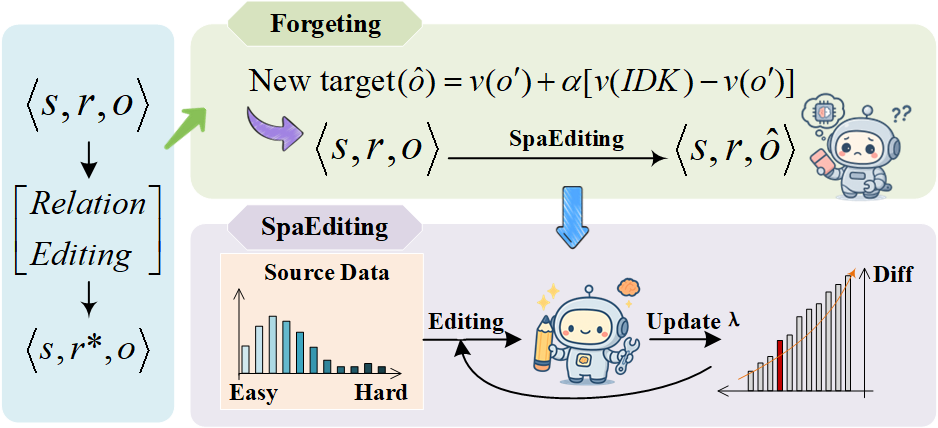

# RelEdit
- Code for [``Relation Editing for Large Language Models``] 

- Knowledge editing is a critical technique for the routine updating and maintenance of LLMs. Existing research predominantly assumes changes only to the object within subject-relation-object triples, with minimal exploration into techniques for editing the relation. We term this task Relation Editing(distinct from the established "Object Editing" paradigm). We first construct a dedicated relation editing dataset and benchmark existing algorithms, revealing their inadequacy for direct use for relation editing. Editing failures stem primarily from two sources: the persistent retention of outdated relationships and the presence of challenging editing samples. To address the aforementioned limitations, we propose a novel relation editing framework called Forgetting-and-Editing (FE), and theoretically reveal that existing forgetting methods(i.e., model unlearning) are unsuitable for knowledge editing-oriented forgetting; to this end, we specifically introduce a new target assignment strategy for unlearning within this framework. To mitigate the latter issue, we introduce a self-paced learning strategy and presenting AlphaEdit as its concrete instantiation, which yields a new algorithm named self-paced AlphaEdit(SPaEdit). We conduct extensive experiments on both our new relation editing dataset and established object editing benchmarks. Results demonstrate that our proposed relation editing strategy achieves satisfactory performance on the relation editing task. In addition, SPaEdit outperforms SOTA object editing methods. Our research also suggests further study is warranted in relation editing, particularly on unlearning existing relations.


*Figure: This is the overall architecture of our SpaEdit method.*

## Requirements
**At least one L40s 48G GPU.**

- pytorch==1.12.1
- einops==0.4.0
- higher==0.2.1
- hydra-core==1.2.0
- transformers==4.23.1
- datasets==1.18.3
- matplotlib==3.6.1
- spacy==3.4.1
- scipy==1.9.2
- scikit-learn==1.0.2
- nltk==3.7


## Quick Start
### An example for editing Llama3 (8B) on counterfact dataset using CurriculumEdit
#### 1. Edit Llama3 (8B) model 
 
    python3 -m experiments.CurriculumKE     --alg_name=CurriculumEdit     --model_name=meta-llama/Meta-Llama-3-8B-Instruct     --hparams_fname=Llama3-8B.json --ds_name=ReEditBench  --dataset_size_limit=2000    --num_edits=100 --downstream_eval_steps=5

This command runs an evaluation script for the AlphaEdit algorithm using the Llama3-8b-instruct. Below are the explanations for each argument:

- `--alg_name=CurriculumEdit`: Specifies the name of the algorithm being used, which is CurriculumEdit in this case.
- `--model_name=meta-llama/Meta-Llama-3-8B-Instruct`: Indicates the name of the model being evaluated, here it is Llama-3-8B-Instruct.
- `--hparams_fname=Llama3-8B.json`: Points to the JSON file containing hyperparameters specific to the Llama-3-8B-Instruct model.
- `--ds_name=ReEditBench `: Specifies the dataset name, in this case, "ReEditBench ".
- `--dataset_size_limit=2000`: Sets the total number of editing samples to 2000.
- `--num_edits=100`: Defines the batch size for each round of editing, meaning 100 edits will be performed in each batch. 
- `--downstream_eval_steps=5`: indicates that a test of general capabilities is conducted after every 5 rounds of editing.

Results from each run are stored at `results/<method_name>/run_<run_id>` in a specific format:
```bash
results/
|__ CurriculumEdit/
    |__ run_<run_id>/
        |__ Step0
        |__ Step1
        |__ Step2
        |__ ...
```

#### 2. Summarize the results  
To summarize the results, you can use [`experiments/summarize_step.py`](experiments/summarize_step.py):

    python summarize_step.py --dir_name=CurriculumEdit/run_<runi> --runs=Step<i>

## Acknowledgment
Our code is based on  [``AlphaEdit``](https://github.com/jianghoucheng/AlphaEdit.git).
