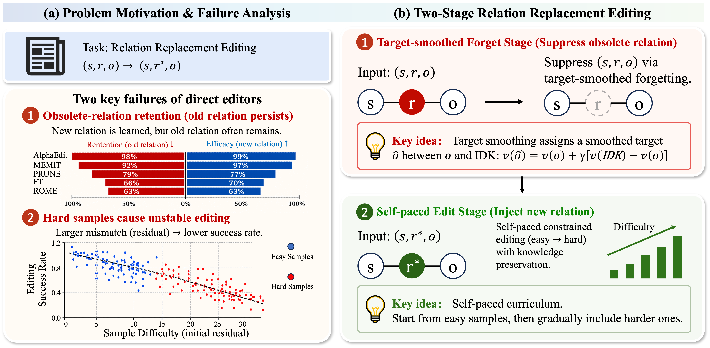

# ⚔️ Relation Replacement Editing for Large Language Models
## 🎉 News
* Our paper has been accepted to **EMNLP 2026**!
**A Framework for Editing Relations in Large Language Models**

This repository contains the official code for the paper, **"Relation Replacement Editing for Large Language Models"**. We tackle a crucial, yet overlooked, aspect of knowledge editing: changing the *relation* in a subject-relation-object triple.

While most research focuses on updating objects (e.g., changing *Paris* in "France's capital is *Paris*"), we explore the challenge of editing the relationship itself (e.g., changing *capital is* to *largest city is*). Our work introduces a new benchmark, a novel editing framework, and an advanced algorithm to address this task effectively.


---

## 💡 Core Contributions

*   **A New Frontier: Relation Editing:** We highlight the limitations of existing knowledge editing methods when faced with relation edits and introduce a dedicated dataset, `ReEditBench`, to spur research in this area.
*   **R2EDIT:** To overcome the model's persistence with outdated facts, we propose a two-step framework. We first encourage the model to "forget" the old relationship before teaching it the new one.

Our experiments show that our strategies excel at the novel task of relation editing. Furthermore, our flagship algorithm, **R2Edit**, also surpasses leading methods on traditional object editing benchmarks.

## ⚙️ Setup and Installation

**Hardware:** You will need at least one **NVIDIA L40S (48G) GPU** to run the experiments.

**Dependencies:** First, ensure you have PyTorch installed. Then, you can install the required packages using pip:

```bash
pip install torch==1.12.1
pip install einops==0.4.0 higher==0.2.1 hydra-core==1.2.0 transformers==4.23.1 \
datasets==1.18.3 matplotlib==3.6.1 spacy==3.4.1 scipy==1.9.2 \
scikit-learn==1.0.2 nltk==3.7
```

## 🚀 Quick Start: Edit Llama-3 8B

Here’s how to run a relation editing experiment on the Llama-3 8B model using our `ReEditBench` dataset.

### 1. Run the Editing Script

Execute the following command in your terminal:

```bash
python3 -m experiments.CurriculumKE \
    --alg_name=CurriculumEdit \
    --model_name=meta-llama/Meta-Llama-3-8B-Instruct \
    --hparams_fname=Llama3-8B.json \
    --ds_name=ReEditBench \
    --dataset_size_limit=2000 \
    --num_edits=100 \
    --downstream_eval_steps=5
```

**Understanding the Arguments:**

*   `--alg_name`: The editing algorithm to use (e.g., `CurriculumEdit`).
*   `--model_name`: The Hugging Face model identifier (e.g., `meta-llama/Meta-Llama-3-8B-Instruct`).
*   `--hparams_fname`: The JSON file with model-specific hyperparameters.
*   `--ds_name`: The dataset for editing (in this case, our `ReEditBench`).
*   `--dataset_size_limit`: Total number of edits to perform from the dataset.
*   `--num_edits`: The number of edits to apply in each batch.
*   `--downstream_eval_steps`: How often (in batches) to run a full evaluation of the model's general capabilities.

Your results will be saved under the `results/` directory, organized by algorithm and run ID:

```
results/
└── CurriculumEdit/
    └── run_<run_id>/
        ├── Step0
        ├── Step1
        └── ...
```

### 2. Summarize the Results

To aggregate and view the results from a specific run, use our summarization script. For example, to summarize the output from `Step<i>` of a run:

```bash
python summarize_step.py --dir_name=CurriculumEdit/run_<run_id> --runs=Step<i>
```

## 🙏 Acknowledgments

Our work builds upon the fantastic research and codebase from the **AlphaEdit** project. We are grateful for their contributions to the field of knowledge editing.
